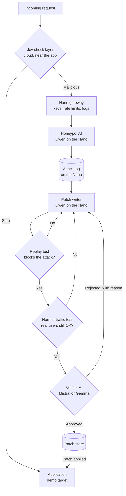
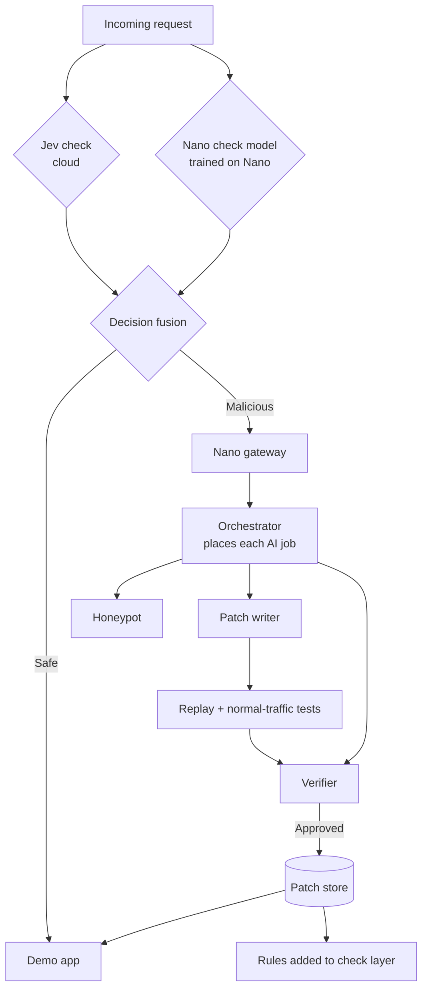

# Chameleon Edge: Handoff for Claude Code

Written 2026-09-24 (about 22:30 UTC) at the end of a planning-and-build session. Everything needed to continue is in this file: the challenge, the architecture, every decision and its reason, the organizers' answers, the datasets, the full source of the code written so far, open issues, and an ordered list of next steps.

**Read this whole file before writing code.** Sections 3 (organizer answers) and 9 (decisions) contain constraints that are easy to violate by accident.

---

## 0. Status at a glance

| Item | State |
| --- | --- |
| Hackathon | HP Edge AI SJSUHack, Secure AI track, team of 5 |
| Final deadline | **Fri Sep 25, 2026, 8:00 PM** (no extensions). Internal target: submit by 6 PM |
| Hardware | One HP ZGX Nano (GB10 Grace Blackwell, 128 GB unified memory, aarch64), reached over SSH through Tailscale from VS Code |
| GitHub repo | `https://github.com/prags8585/EdgeA1`: **still empty on GitHub** |
| Working branch | `claude/serene-albattani-mgr3xg` |
| Code written | Check model (dataset builder, trainer, local API, tests): **one local commit `f276b9e`, not pushed** (the cloud session had no GitHub write access). Full source is in section 12 |
| Architecture doc | Published Claude doc "Chameleon Edge: Final Architecture": https://claude.ai/code/artifact/66759658-3df1-4bb4-ba58-102a7388ea8c (its content is reproduced here) |
| Not started | Model serving on the Nano, honeypot, patch writer, tests, verifier, orchestrator, gateway, demo app, dashboard, red-team agent, fine-tune, benchmarks, submission material |

If the repo on the Nano is empty, **recreate the files from section 12 first** (NEXT STEPS, step 1).

---

## 1. The event and its rules

### 1.1 Official challenge text (HP Edge AI SJSUHack)

Tagline: *"Build something real that runs at the edge first and reaches the cloud only when it needs to."*
Format: 25 teams, one ZGX Nano GB10 unit per team, 1 week, SSH-only access, train and serve locally.

**The challenge (quoted closely):** Cloud-only AI is expensive, latency-bound, and legally awkward the moment sensitive data leaves the building. Cloud-free AI hits a capability ceiling. Prove the third path.

> Build a working edge AI application that **runs its primary inference on your assigned ZGX Nano**, and that makes an **explicit, defensible, measurable decision about when to escalate to the cloud.**

- You must **name a target user** (examples given by HP: a cyber security professional, an AI engineer, a nurse, a line supervisor, a field technician, a school counselor, a musician) and **name the problem** you solve for them.
- You must show it solves the problem **under conditions the cloud alone cannot**: no connectivity, hard latency budgets, data residency constraints, per-token cost ceilings, data gravity, or sovereign AI requirements.
- "This is not a demo-of-a-model contest. It is an Edge AI systems contest."

### 1.2 Hardware and access rules

- ZGX Nano on NVIDIA GB10 Grace Blackwell Superchip, **128 GB coherent unified memory**. HP says models up to roughly **200B parameters at NVFP4** can be served; peak about 1 PFLOP at FP4. Smaller models can be **fine-tuned on device**, and teams are encouraged to train custom models.
- **Access:** SSH only. Devices use usernames `hp1` … `hp25`; credentials were issued at kickoff. **Never commit the credentials.** Never access another team's device.
- **Networking:** all 25 units share one SJSU subnet (and a Tailscale network). Units are peers, not a cluster. Coordinated multi-unit experiments are not supported. **A port bound to 0.0.0.0 is reachable by other teams**, so bind servers to 127.0.0.1.
- **Rules of engagement:** do not SSH into another team's node; do not saturate shared egress; do not `sudo reboot` and walk away. You may use anything else you can install. **You may not offload core inference to a cloud GPU and call it edge**, but you can orchestrate complex workloads to the cloud if it is architected as part of the prototype.
- **State:** assume the node is **wiped at the end**. Everything that matters must live in the repo (and trained models on Hugging Face).
- Serving must use **ZRT** (`zrt serve`), which wraps **vLLM**. **Ollama is not allowed.**
- Other rules in the implementation guide: no pre-event code (first commit must be dated after the Sep 21 kickoff); the general rules ban cloud AI as core inference and paid cloud GPU services (SageMaker, Vertex, Azure ML). Cloud AI may be used to help troubleshoot setup (that covers using Claude Code for development).

### 1.3 Deliverables (from the HP packet, via the implementation guide)

| Deliverable | What "done" looks like |
| --- | --- |
| Public GitHub repo | Code, `README.md`, a `Dockerfile` or `scripts/setup_nano.sh`, `.env.example` (no secrets), LICENSE. A fresh person can replicate it. Repo may be private during the event but **must be public at submission** |
| Metrics | `docs/benchmark-methodology.md`: the metrics, **how and why each was chosen**, plus result files |
| Demo (5 min) on the Nano | Driven over SSH or a tunneled port; a pre-recorded video of it is allowed |
| Video, 2 min max | Uploaded to **public YouTube**, also submitted as a file |
| Interactive presentation | Dynamic, not static slides (the dashboard plus a small HTML deck works) |
| Google Drive folder (SJSU) | Project brief, pitch video, links, presentation, diagrams, photos |
| Socials | Posts during the event and with the final pitch, tagging the accounts listed in the packet |
| Pitch readiness | One architecture visual, one benchmark/evidence visual, one impact visual; 3 minutes of Q&A |

README order suggested by the guide: one-line description; 30-second demo link; problem and target user; why edge; architecture diagram; how the edge-versus-cloud router works; attacks and defenses; training pipeline on the Nano; benchmarks and how they were chosen; quick start; ZGX Nano setup (`zrt`, model ids, serve scripts); API; safety boundaries; limitations; references; team.

### 1.4 Timeline

| When | What |
| --- | --- |
| Sep 25, morning | Finish core flow, fine-tune, benchmarks |
| Sep 25, **noon** | Feature freeze |
| Sep 25, noon–3 PM | Record video (rehearse the 5-minute path 3 times), finish README and Drive folder |
| Sep 25, 3–5 PM | Publish YouTube, **flip repo public**, post socials |
| Sep 25, by 6 PM | Submit everything (hard deadline 8:00 PM) |

---

## 2. History: how we got to this design

1. The team started with a planning PDF, **"Chameleon Edge: End-to-End Implementation Guide"** (13 phases). It described a *local AI security analyst* judging synthetic endpoint-telemetry sessions (abuse of trusted remote-support tools), attacked by a local red-team model with prompt injection, protected by defenses D1–D7, fine-tuned on the Nano, with a gated patch loop, a cloud escalation router, a "Chameleon decoy", and a live Cloud vs Nano vs Hybrid dashboard.
2. We checked it against the official challenge: well aligned (localhost-only model URLs, explicit router, tests for no-connectivity/latency/residency/cost). Gaps: the target user needed to be named explicitly, and the cloud tier needed organizer confirmation.
3. **The user pivoted the core idea**: the product is a **security layer in front of an application**. It checks each incoming request; safe requests go to the app; **malicious requests are rerouted to the ZGX Nano**, where a **honeypot AI** talks to the attacker. This promotes the old Phase 10 "Chameleon decoy" to the core.
4. The user chose **Jev** (TypeSafe AI) as the malicious/safe decision model, running **in the cloud next to the app**, so checking adds little delay for normal users.
5. On the Nano, the AI also **writes code patches** from each attack so the app is protected next time.
6. The user required that **a different model verifies each patch**, because a model tends to approve its own work.
7. The user excluded **Llama** models; models come from Hugging Face and are served with vLLM.
8. **ZGX Fury** (larger HP hardware) is future scope, framed as scale.
9. An architecture doc was written and published (section 0 link).
10. Organizers answered our questions (section 3). Their answers push toward **a model trained and hosted on the Nano** and **an orchestrator/router** with measured numbers.
11. We picked datasets and built the **Nano check model** (a classifier trained and served on the Nano). It is done and tested (section 12).

The implementation guide's original telemetry-session simulator, analyst modes and attack families F1–F7 were for the *old* concept. Reuse ideas from it (defense layering, honest benchmarks, patch gate), but the product is now the request-security layer with a honeypot.

---

## 3. Organizer answers (authoritative)

The team asked four questions. The organizers' answers, verbatim in substance:

| # | Question (summary) | Organizer answer | What it means for us |
| --- | --- | --- | --- |
| 1 | Main AI on the Nano, a small share of hard cases sent as a sanitized summary to a cloud API: allowed? | **OK.** Best if an **orchestrator/router** does it. If done manually, share what you did and the data/metrics, e.g. "models of size X didn't fit on the Nano, so we did work xyz on the Nano and work abc in the cloud, which cost this much compute and $" | Build an orchestrator that logs every placement decision with cost and latency |
| 2 | Can we compare against a cloud model for benchmarks? | **Yes, but the prototype must have trained the model and host that model on the Nano** | Hard requirement: a model **we trained** must be **served from the Nano** in the demo. The check classifier satisfies this now; an LLM fine-tune strengthens it |
| 3 | Is AWS Bedrock (pay-per-call API, not a rented GPU) allowed? | **Yes, but AWS people are judges**, so consider sensitivities or use an alternative to AWS | Never frame it as "cloud bad, edge good". Say each does what it's best at, and report where the cloud wins. Jev is not AWS, so the check layer raises no AWS sensitivity |
| 4 | If cloud is disallowed, can a second Nano model stand in for "cloud"? | **Unclear, but yes**, if you can fit it. If not, one on the Nano and others in the cloud, then **design routing/orchestration/merging** | Multiple models on the Nano are fine. If one doesn't fit, the orchestrator moves it to the cloud, which becomes a feature |

**Important:** these questions were asked about the *earlier* design (Nano first, cloud only for hard cases). The final design sends **every** request through a cloud check (Jev) first. Send the organizers this follow-up and save a screenshot of the answer:

> "Our final design runs a fast cloud check (TypeSafe's Jev API) next to the app on every request, and a model we trained runs on the Nano as a second check. Malicious requests go to the Nano, where our fine-tuned models run the honeypot, write patches and verify them. Is that OK?"

---

## 4. Product definition

**Name:** Chameleon Edge.

**One line:** An AI security layer that sends attackers to a decoy AI on the ZGX Nano, then turns each attack into a tested, independently verified security patch.

**Target user:** a **security engineer or SOC analyst** protecting a company application from attacks, including insiders ("a cyber security professional" is one of HP's own example personas).

**Their problem:**
- Blocking an attack teaches the defender nothing; the attacker simply tries a new variation.
- Studying attackers safely needs isolation, and long attacker conversations through cloud AI cost money per token.
- Writing and reviewing a fix for every new attack is slow, manual work.
- Attack data (payloads, techniques, logs) is sensitive and shouldn't go to third-party clouds.

**What it does:**
1. A fast check layer decides whether each incoming request is malicious.
2. Safe requests go to the real application.
3. Malicious requests are quietly rerouted to the ZGX Nano, where a honeypot AI keeps the attacker engaged and records what they try.
4. From each attack, an AI on the Nano writes a security patch.
5. A second AI from a **different model family**, plus automated tests, verifies the patch.
6. The approved patch protects the app against that attack type from then on.

**The application behind the layer is only a demo target. The product is the security layer.** The user decided the demo should cover **both** attack kinds:
- a **regular web API** (SQL injection, XSS, command injection, path traversal), and
- an **AI chatbot endpoint** (prompt injection, jailbreaks).

**Why edge wins (pitch):**
- **Containment:** attacker traffic never reaches the real app; it stays trapped on one physical box.
- **Cost:** attackers can chat with the honeypot for hours; on the Nano that has no per-token cost.
- **Privacy / data residency:** attack logs, payloads and patches stay on-site.
- **Works offline:** the Nano-side work keeps running if the cloud link drops.

**Suggested pitch line tying to HP research:**
> "HP's own research shows attackers now use AI to build new attack variations faster than defenses can adapt. Chameleon Edge answers with AI on the defense side: it traps each attacker, learns from the attack, and ships a verified patch automatically."
Say the project **builds on** HP's findings about AI-driven attacks. **Do not** claim HP published research on this exact problem (we found none).

---

## 5. Architecture

### 5.1 Final architecture as published in the doc



Step by step:
1. A request arrives for the application.
2. The Jev check layer returns a typed verdict (malicious or safe) with a confidence score.
3. **Safe:** straight to the application; the user notices nothing.
4. **Malicious:** forwarded to the gateway on the ZGX Nano.
5. The honeypot AI answers as if it were the real app, keeps the attacker engaged, serves only fake data with canary tokens.
6. Everything the attacker sends is saved to the attack log on the Nano.
7. The patch writer reads the attack and writes a patch (e.g. an input-validation rule or a code fix).
8. Replay test: re-run the attacker's request against the patched app; the patch must block it.
9. Normal-traffic test: run legitimate requests; the patch must not block real users.
10. Verifier AI (different family) reviews the patch for mistakes and new security holes.
11. Any failure: back to the writer, with the reason.
12. All three pass: patch saved to the patch store and applied.

### 5.2 Recommended amendments after the organizer answers (partly built, awaiting team sign-off)

These were proposed after the doc was written. The Nano check model is **already built**. The architecture doc itself was not changed, because the user asked to keep it as is while discussing.

1. **Nano check model (built):** a classifier **trained and served on the Nano** (`127.0.0.1:8010`). Jev stays in the cloud for the fast first check. The Nano model double-checks, handles cases where Jev is unsure, and takes over if Jev is down or not approved in time. It also gives a benchmark (our trained Nano model vs Jev) and satisfies organizer answer 2.
2. **Orchestrator on the Nano:** decides **where each AI job runs** (honeypot turn, patch writing, verification). Default is the Nano; if memory is full or a model doesn't fit, it sends the job to a cloud model and logs why, with cost and latency. Satisfies organizer answers 1 and 4.

Amended flow, which the NEXT STEPS below implement:



Decision fusion, as a starting point to tune: malicious if either model is confident. If Jev is unavailable, use the Nano model alone. Log both scores for every request, because the disagreement cases are interesting evidence.

### 5.3 Components

| Component | What it does | Runs on | Why |
| --- | --- | --- | --- |
| Jev check layer | Classifies each request as malicious/safe with confidence | Cloud, next to the app | Fast typed decisions, no text generation; placed near the app so normal users see almost no extra delay |
| Nano check model (built) | Same job, our own trained classifier | Nano, `127.0.0.1:8010` | Organizer requirement: a model we trained, hosted on the Nano. Fallback and second opinion |
| Application (demo) | The software being protected: a small web API plus a chatbot endpoint | Local on the Nano (or cloud) | A demo target only, not part of the product |
| Nano gateway | Receives rerouted requests; API keys, rate limits, audit log | Nano, `:8085` | The only door into the Nano; model servers stay on localhost |
| Orchestrator | Places each AI job on a Nano model or a cloud fallback; logs placement, cost, latency | Nano | Organizer answers 1 and 4 |
| Honeypot AI | Pretends to be the real app, keeps the attacker engaged, serves fake data with canaries | Nano (Qwen via vLLM) | Wastes attacker time, captures techniques, exposes nothing real |
| Attack log | Stores every attacker message, payload, session | Nano (SQLite) | Evidence for patching and the dashboard; stays on-site |
| Patch writer | Writes a patch that blocks the observed attack | Nano (Qwen via vLLM) | Turns each attack into a defense automatically |
| Automated tests | Replay test and normal-traffic test | Nano | Hard, repeatable proof independent of any AI's opinion |
| Verifier AI | Independently reviews the patch | Nano (Mistral or Gemma via vLLM) | Different family, different blind spots |
| Patch store and dashboard | Versioned approved patches with rollback; live metrics for both cloud and Nano | Nano | One screen for attacks, patches, decisions, cloud vs Nano numbers |

### 5.4 Ports (corrected 2026-09-25 after testing real ZRT behavior; keep everything on 127.0.0.1 except the gateway)

**Correction to the original plan:** `zrt serve` does not give each model its own port. Every model ZRT serves — however many you start — goes through **one shared proxy** (default `127.0.0.1:8080`), and requests are routed to the right backend by the OpenAI `"model"` field (the `--label`/served-as name), not by port. So the writer and verifier models share port 8080, distinguished by `"model": "writer"` vs `"model": "verifier"` in the request body. This freed up 8002/8003 and forced the gateway off 8080 (moved to 8085 below).

**ZRT proxy gotcha (reproduced 2026-09-25, cost about 15 minutes to debug):** immediately after `zrt stop`/`zrt stop --all`, a fresh `zrt serve` can register with the proxy and then have the proxy deregister it and shut down 2-3 seconds later (`zrt services` shows `Dead`, `zrt logs tail proxy` says `removed 1 ... new total 0, shutting down cleanly`), even though the actual vLLM backend is still alive and loading normally underneath. This is a stale-state race in ZRT's own proxy bookkeeping, not a real crash or an OOM — the backend process (`ps aux | grep EngineCore`) keeps running fine. **Fix:** after any stop, explicitly confirm zero processes and an empty `zrt services` table before the next `zrt serve` (`zrt stop --all`, kill any leftover tmux/vllm processes, `sleep 2-3`, verify, then serve). Restarting immediately after a stop reproduces the bug reliably; waiting for a clean slate avoids it every time in testing.

| Port | Service |
| --- | --- |
| 8080 | ZRT proxy (OpenAI-compatible, shared by every `zrt serve`d model: writer, verifier). Route by `"model"` name, not port |
| 8010 | Nano check model API (built, plain FastAPI/uvicorn, not through ZRT) |
| 8085 | Nano gateway (keyed reverse proxy). Only bind beyond localhost if the demo truly needs it, and never expose it to the public internet |
| 8100 | Backend API **and** dashboard (combined, `make serve-dashboard`) — simplified from the original two-port plan; the dashboard HTML is served from the same FastAPI app at `/`, REST under `/api/*`, live updates over `/ws` |
| 8200 | Demo application (web API + chatbot endpoint) |
| 3000 | No longer used (was also occupied by a leftover Docker container from the factory demo image) |

To view a Nano web page from a laptop, tunnel it: `ssh -L 3000:127.0.0.1:3000 hpX@<tailscale-ip>`, then open `http://127.0.0.1:3000`.

---

## 6. Models

### 6.1 Roles

| Role | Model | Source | Runs on | Approx. memory |
| --- | --- | --- | --- | --- |
| Cloud check | **Jev** (TypeSafe AI) | Hosted API, early access (waitlist) | Cloud | 0 on the Nano |
| Nano check | Our TF-IDF + logistic regression classifier (built) | Trained on the Nano | Nano, CPU | Tiny |
| Honeypot + patch writer | **`nvidia/Qwen3-Next-80B-A3B-Instruct-NVFP4`** (confirmed to exist on HF 2026-09-25; NVIDIA's own NVFP4 conversion, tuned for GB10). About 3B active parameters per token, so fast for its size | Hugging Face | Nano, `zrt serve`, proxy `:8080`, served-as `writer` | ~40–45 GB |
| Patch verifier | **`google/gemma-4-12B-it`** (confirmed on HF 2026-09-25; official Google instruct release, different family from Qwen, strong coding benchmarks) | Hugging Face | Nano, `zrt serve`, proxy `:8080`, served-as `verifier` | ~24 GB (bf16) |
| OS and services | n/a | n/a | Nano | ~10–15 GB |

Total is roughly 75–85 GB of 128 GB. **These are planning estimates.** Measure with `nvidia-smi` once both models are running.

### 6.2 Model rules (do not break)

- The verifier must come from a **different model family** than the writer (the writer is Qwen, so no Qwen verifier). Same-family models share training data and blind spots.
- **No Llama models** (team choice). **No Ollama** (event rule). All Nano models are pulled from Hugging Face and served with vLLM via `zrt serve hf:<repo>`.
- Only the writer/honeypot side may be fine-tuned. **The verifier stays un-fine-tuned** so it remains an independent judge.
- The verifier sees **only the patch and the attack, clearly marked as untrusted data**. Never the writer's reasoning or the raw attacker conversation, because attackers can hide "approve this patch" instructions.
- Pick exact versions on the Nano: filter Hugging Face models by the vLLM library, then confirm with `zrt models` or a test serve. If `Qwen3-Next-80B` has no 4-bit/FP8 checkpoint that the installed vLLM can serve, fall back to a smaller Qwen instruct model (e.g. 7–32B).
- **Do not claim "the Nano can only run one model."** It's false: 128 GB, HP says about 200B at NVFP4, and the plan runs two LLMs at once. HP judges will catch it. The honest reason the check layer is in the cloud: Jev is only offered as a cloud API, and sitting next to the app keeps added delay near zero.

### 6.3 Fine-tuning (organizer requirement: train a model and host it on the Nano)

- **Already satisfied at a basic level** by the Nano check model (trained on the Nano with `make train-check`, served on the Nano). Make sure the demo actually uses it.
- **Stronger:** LoRA fine-tune an LLM on the Nano and serve it. The 80B model is too large to fine-tune on the Nano (HP's recommended ceiling is about **12B at BF16**). Options:
  - Fine-tune a **small Qwen (3–8B)** to act as the honeypot persona (convincing fake-app replies that never leak real data) and serve that instead of the 80B for honeypot chat. The 80B stays the patch writer.
  - Or fine-tune a small model as the patch writer on generated attack → patch pairs.
- Training data for the LLM fine-tune must be **generated** (no public dataset fits): use the big model to produce attack → patch pairs and honeypot dialogues, and cache them to disk.
- Stop the big model before training to free memory, then restart it.
- Shrink rule if short on time: smaller model (3B), about 500 examples, 1 epoch. The floor is the already-built classifier.
- HP's README reports 30–55 GB peak for a 7B VLM LoRA with images; text-only should be lower.

### 6.4 vLLM / ZRT serving notes (from the implementation guide and HP's README)

```bash
# terminal 1 (tmux new -s big): big model first, with a bounded memory share
zrt serve hf:<qwen-big-model-repo> \
  --host 127.0.0.1 --port 8002 \
  --tensor-parallel-size 1 \
  --max-model-len 8192 \
  --gpu-memory-utilization 0.55

# terminal 2 (tmux new -s verifier): verifier
zrt serve hf:<verifier-model-repo> \
  --host 127.0.0.1 --port 8003 \
  --tensor-parallel-size 1 \
  --max-model-len 8192 \
  --gpu-memory-utilization 0.25

# smoke test (OpenAI-compatible API)
curl -s http://127.0.0.1:8002/v1/chat/completions \
  -H 'Content-Type: application/json' \
  -d '{"model":"hf:<qwen-big-model-repo>","messages":[{"role":"user","content":"Say OK."}]}' | jq .
```

- `--tensor-parallel-size 1` (single GPU).
- Keep `--max-model-len` bounded (HP uses 16384; we use 8192). The huge default reserves a giant KV cache and can run out of memory on unified memory. **Confirmed 2026-09-25:** serving `nvidia/Qwen3-Next-80B-A3B-Instruct-NVFP4` through `zrt serve` with no override defaulted to `max_model_len=262144` (the checkpoint's native context) and the backend silently died (SIGKILL, no Python-level error, both the APIServer and EngineCore processes just vanished) partway through CUDA graph capture -- almost certainly an OOM from the KV-cache reservation for a 262k-token window on an 80B model. **Through `zrt serve` specifically**, bound it with `--extra '--max-model-len=8192'` (not a bare `--max-model-len` flag, which zrt doesn't expose directly): `zrt serve hf:<repo> --label <name> --extra '--max-model-len=8192'`. This fixed the KV-cache OOM, but the retry hit a **second, different** crash (below) -- it did not fully succeed on this attempt alone.
- **Second crash, same model, confirmed 2026-09-25:** with `max-model-len` fixed, the backend got past weight loading and graph capture but then died during FlashInfer's JIT compilation of its FP4 GEMM cutlass kernels for sm120 (17 kernel variants, built in parallel via ninja+nvcc). One `nvcc` subprocess got `Killed` (host-RAM OOM -- the Nano has 20 CPU cores, so ninja defaulted to ~20 parallel compile jobs, each using multiple GB, while the 44 GiB model was already resident), which made the whole `ninja` build fail and crashed engine-core startup with `RuntimeError: Engine core initialization failed`. **Fix:** cap FlashInfer's JIT parallelism with the `MAX_JOBS` env var (it's read directly in `flashinfer/jit/cpp_ext.py`): `MAX_JOBS=4 zrt serve hf:<repo> --label <name> --extra '--max-model-len=8192'`. Verify it actually reached the subprocess with `tr '\0' '\n' < /proc/<vllm_pid>/environ | grep MAX_JOBS` if in doubt.
- **Do not pass `--quantization`**; vLLM detects it from the checkpoint. Forcing it causes kernel mismatches.
- For agentic use HP suggests `GENERIC_OPENAI_STREAMING_DISABLED=true` in the environment.
- If the second server refuses to start, lower the first one's `--gpu-memory-utilization` and start them one at a time.
- NVFP4 needs a recent vLLM (HP notes 0.12+, ideally 0.13). If NVFP4 crashes with `flashinfer_scaled_fp4_mm` or `Failed to run cutlass FP4 gemm on sm120`, fall back to FP8 or BF16 -- or, as found above, just cap `MAX_JOBS` and retry; the kernel itself compiles fine, it just needs less parallelism to fit in host RAM alongside the loaded model.
- Run servers in `tmux` so they survive dropped SSH sessions.
- Save the exact serve commands as `scripts/serve_big.sh` and `scripts/serve_verifier.sh`.
- vLLM supports JSON-schema constrained output via the OpenAI `response_format` field. Use it for verifier verdicts and patch output, but still validate with Pydantic and retry once.
- Record baseline throughput early: `scripts/bench_llm.py` with 50 requests at concurrency 1, 4, 8, logging p50/p95 latency and tokens/s to `results/llm_baseline.csv`. This tells you how many benchmark runs fit in the time left.

### 6.5 Jev (TypeSafe AI) facts

From news coverage, September 2026 (confirm on TypeSafe's site before the pitch):
- Released in limited early access on **Sep 15, 2026**, behind a **waitlist**. TypeSafe AI is a San Francisco company founded in 2024.
- A "System One" **decision model**: returns **typed values with probabilities and confidence scores**, not generated text. Marketed as far faster and cheaper than LLMs for decisions (Tom's Hardware headline: "193x faster and 445x cheaper").
- **Cloud-only, closed weights**: hosted API only, no self-hosting, no downloadable weights. Priced per input token. The public SDKs are clients for the hosted model.
- Community "Jev-like" open models exist (SemIf/OpenJev, Laya). Unofficial and **unverified**; don't rely on them without testing.
- **Known risk:** coverage (VentureBeat) notes Jev's verdicts can be swayed by prompt injection in untrusted text. Mitigation: send Jev only the fields it needs, and use the Nano model and pattern rules as extra signals.
- **Action:** sign up for the waitlist now. If there's no access by the morning of Sep 25, drop Jev and use the Nano check model alone (it's built).

The exact Jev API (endpoint, auth header, request schema) was **not** looked up in this session. Get it from TypeSafe's docs once access is granted. Keep the key in `.env` as `JEV_API_KEY`.

---

## 7. Design decisions and reasons (the decision log)

| # | Decision | Rejected alternative | Reason |
| --- | --- | --- | --- |
| 1 | The product is the security layer; the app is only a demo target | Build a full app | Scope: the layer is what's novel |
| 2 | Reroute attackers to a honeypot instead of blocking | Return an error | Blocking teaches nothing; a honeypot captures techniques |
| 3 | Honeypot, patching and verification run on the Nano | Run them in the cloud | Containment, no per-token cost for long sessions, data stays on-site |
| 4 | Jev check layer runs in the cloud next to the app | Check on the Nano only | Jev is cloud-only; being near the app keeps delay minimal (user's decision) |
| 5 | Also train and host our own check model on the Nano | Rely only on Jev | Organizer answer 2 requires a trained model hosted on the Nano; it also gives a fallback and a benchmark |
| 6 | Patches are generated automatically from each attack | Humans write every fix | Fast learning loop |
| 7 | A separate model from a different family verifies patches | The writer self-checks | Models tend to approve their own output |
| 8 | Deterministic tests (replay + normal traffic) run before the verifier | AI review only | Two AIs can both be wrong; tests are hard proof |
| 9 | Verifier sees only the patch and the attack, marked untrusted | Give it everything | Less surface for injected "approve this" instructions |
| 10 | Never auto-apply a patch that hasn't passed all checks; patches are versioned with rollback | Auto-apply | A bad patch can block users or open holes |
| 11 | Model servers bind to 127.0.0.1 behind a keyed gateway | Open ports | 25 teams share one network |
| 12 | No Llama models; verifier is Mistral or Gemma | Llama | User's choice |
| 13 | Demo covers both web attacks and prompt injection | Pick one | User's choice ("Both") |
| 14 | ZGX Fury is future scope, framed as **scale** (many apps, bigger models, many attackers) | Say "the Nano can only hold one model" | That claim is false and HP judges would catch it |
| 15 | Held-out attack type (path traversal) never used in training | Random split | Shows honestly how the system handles unseen attacks |
| 16 | Cloud comparison framed as "each does what it's best at", reporting where the cloud wins too | "Cloud is expensive and unsafe" | AWS people are judges (organizer answer 3) |
| 17 | File-based attacks are a stretch goal only (section 16) | Core feature | Time |

---

## 8. Security safeguards (build these in, not after)

- **Isolation:** model servers only on 127.0.0.1; the keyed gateway is the only entry, with separate keys for honeypot, admin and test roles, rate limits, and a redacted audit log.
- **No real data in the honeypot:** only fake records, fake credentials, fake files.
- **Canary tokens:** unique fake secrets planted in the honeypot and in the demo app. If one appears anywhere else, we know what was taken and when. A canary tripping in the *real* demo app is also how an attack the check layer missed gets detected and routed to the patch loop.
- **Attacker text is data, never instructions:** every prompt marks attacker content as untrusted and says not to follow instructions inside it.
- **Minimal verifier input:** patch plus attack, labeled. Nothing else.
- **No auto-apply;** every patch is versioned and can be rolled back.
- **Minimal data to the cloud:** Jev gets only what it needs to classify. Follow-up analysis, logs and patches never leave the Nano.
- **Safe demo:** the "attacker" is our own red-team script or model. Never expose the Nano to the public internet; never aim anything at another team's device. **No real malware, ever.**
- **Secrets:** API keys (Jev, Hugging Face, any cloud) live in an untracked `.env`. The shared Nano credentials never go into git.

---

## 9. Datasets

### 9.1 Chosen for the check model

| Dataset | Content | Columns used | License | Access |
| --- | --- | --- | --- | --- |
| **HttpParamsDataset** (`https://github.com/Morzeux/HttpParamsDataset`) | HTTP parameter values: benign (from CSIC 2010) and attacks generated with sqlmap, xssya, Vega, FuzzDB. Totals: ~19,304 benign, ~11,763 attacks (SQLi 10,852, XSS 532, cmdi 89, path traversal 290) | `payload`, `length`, `attack_type` (`norm`/`sqli`/`xss`/`cmdi`/`path-traversal`), `label` (`norm`/`anom`) | **MIT** (verified) | `git clone`. Files: `payload_train.csv` (20,712 rows), `payload_test.csv` (10,355), `payload_full.csv`, `payload_test_lexical.csv` |
| **deepset/prompt-injections** (Hugging Face) | User inputs labeled prompt injection or not (English and some German) | expected `text`, `label` (1 = injection) | Check the dataset page | `datasets.load_dataset` |
| **jackhhao/jailbreak-classification** (Hugging Face) | Prompts labeled `jailbreak` or `benign` | expected `prompt`, `type` | Check the dataset page | `datasets.load_dataset` |

**The two Hugging Face datasets have not been downloaded or inspected yet.** Hugging Face was blocked from the cloud sandbox. Their column names above come from memory and dataset descriptions. On the first `make data` run on the Nano, **verify the split names (`train`/`test`) and columns**. If they differ, fix `load_deepset` / `load_jackhhao` in `chameleon/check/dataset.py`.

**Gotcha already handled:** HttpParamsDataset contains literal `null` payloads (334 in train). Pandas turns them into NaN by default, so every `read_csv` uses `keep_default_na=False`.

### 9.2 Splits (implemented in `chameleon/check/dataset.py`)

- `data/check/train.csv`: all source train splits **minus held-out attack types**, deduplicated.
- `data/check/test.csv`: all source test splits minus held-out types, deduplicated, and **any text that also appears in train is removed** (no leakage).
- `data/check/heldout.csv`: every row whose `attack_type` is in `HELDOUT_ATTACK_TYPES = {"path-traversal"}`, from both splits. These are never trained on.
- Columns everywhere: `text`, `label` (1 = malicious), `source`, `attack_type` (`benign` for label 0).
- Reserve the **benign** rows of `test.csv` for the patch normal-traffic test, and attack rows for the replay test.

### 9.3 Optional extras

- **HTTP DATASET CSIC 2010** (`https://www.impactcybertrust.org/dataset_view?idDataset=940`): about 36,000 normal and 25,000+ anomalous full HTTP requests to an e-commerce app. More realistic, but bigger, older, and download may need registration.
- **xTRam1/safe-guard-prompt-injection** (Hugging Face): larger synthetic prompt-injection set.
- `protectai/deberta-v3-base-prompt-injection-v2` is a public detector trained on these datasets, useful as a comparison baseline.

### 9.4 Data we must generate ourselves

- Honeypot dialogues and attack → patch pairs (for the LLM fine-tune and the patch pipeline), generated by the big model on the Nano and cached under `data/generated/` with the seed and model name recorded.
- Red-team attack traffic for the demo and benchmarks: replay held-out rows plus model-generated variations.
- Always state in the README and deck that the data is **synthetic or public benchmark data**.

---

## 10. Metrics and benchmarks to report

Only numbers measured on the Nano. Record network conditions and GPU load next to every latency number. Enter cloud prices as settings from the provider's current price page; never hardcode a claimed price.

| Area | Metric | Why |
| --- | --- | --- |
| Check layer | Detection rate (attacks correctly rerouted) | Attackers actually reach the honeypot |
| Check layer | False-positive rate (real users wrongly rerouted) | A layer that traps real users is useless |
| Check layer | Added delay per normal request, median and p95 | Normal users must not feel it |
| Check layer | Nano check model vs Jev: accuracy, latency, cost | Our trained model vs the cloud |
| Check layer | Recall on the **held-out attack type**, before and after the patch loop learns it | Core proof that the system learns |
| Honeypot | Attacker engagement time, messages per session | The decoy is convincing |
| Honeypot | Canary tokens triggered | What attackers tried to steal |
| Patching | Time from attack to approved patch | Speed of learning |
| Patching | % of patches that block the attack on replay; % that break normal traffic | Quality and safety |
| Verification | Patches the verifier rejected that the writer thought were good | Proof that a second model catches mistakes |
| Re-attack | Attack success before vs after patching, including new variations | The app actually gets stronger |
| Orchestrator | Jobs run on the Nano vs cloud, with the reason, latency, tokens, $ | Organizer answer 1 |
| Edge vs cloud | Cost per 1,000 attacker sessions on the Nano vs the same work on a cloud model | Cost argument |
| Edge vs cloud | Bytes of attack data sent off the Nano (target 0) | Data residency |
| Fine-tuning | Base vs fine-tuned model on the relevant metrics | Training helped |
| System | Throughput and memory use with both LLMs running | It fits the Nano |

Honesty rules: say the data is synthetic/public; report held-out results, not only training-family results; never present numbers as enterprise performance; don't publish a number you didn't measure.

---

## 11. Environment and setup

### 11.1 Where things run

- **Development:** Claude Code inside VS Code, connected over SSH (Remote-SSH) via Tailscale to the ZGX Nano. Work directly on the Nano.
- The earlier cloud session **could not reach the Nano**. This session (on the Nano) can.
- Nano OS: Linux on **aarch64**. Check with `uname -m`, `nvidia-smi`, `zrt status`.
- Python 3.10+ (code uses `from __future__ import annotations`; tested on 3.11).

### 11.2 First-time setup on the Nano

```bash
whoami; hostname; uname -m        # expect aarch64
nvidia-smi                         # GPU visible
zrt status                         # ZRT healthy
zrt models                         # which models ZRT knows about

git clone https://github.com/prags8585/EdgeA1.git && cd EdgeA1   # repo is empty until code is pushed
git checkout -b claude/serene-albattani-mgr3xg                     # or main; see section 14
python3 -m venv .venv && source .venv/bin/activate
cp .env.example .env               # fill in HF_TOKEN, JEV_API_KEY; never commit .env
make setup
```

`datasets` needs Hugging Face access. If a dataset is gated, run `huggingface-cli login` (token in `.env`).

### 11.3 Daily backup (the node is wiped at the end)

```bash
git add -A && git commit -m "..." && git push
huggingface-cli upload <hf-user>/chameleon-edge-models models/   # trained models / adapters
```

### 11.4 Dependencies (`requirements.txt`)

scikit-learn, pandas, numpy, joblib, datasets, fastapi, uvicorn, httpx, pytest. vLLM and ZRT are provided by HP's setup on the Nano; don't pip-install vLLM into the project venv unless ZRT's docs say to.

---

## 12. Code written so far

See the repository itself — `chameleon/check/`, `scripts/fetch_datasets.py`, `tests/test_check.py`, `Makefile`, `requirements.txt`, `.env.example`, `.gitignore`, `LICENSE`, `README.md`. Restored on the Nano on 2026-09-25 from this handoff.

### 12.4 Check model API

- `GET /health` returns `{"ok": true}` (loads the model).
- `POST /check` with body `{"inputs": ["<field value>", ...]}`: 1–100 strings, one per untrusted field (each URL/form parameter value, or a chat message). Returns `{"malicious": bool, "score": float, "worst_input_index": int, "latency_ms": float}`. The request is scored by its most suspicious input.
- Env vars: `CHECK_MODEL_PATH` (default `models/check_model.joblib`), `CHECK_THRESHOLD` (default `0.5`).
- Start: `make serve-check` (uvicorn on 127.0.0.1:8010).

---

## 13. Results so far (cloud sandbox, x86, HttpParamsDataset only)

**Not Nano numbers.** The metrics file from this run was deliberately not committed. Re-run on the Nano with all three datasets for official numbers.

| Measure | Result |
| --- | --- |
| Train rows / time | 20,519 rows, about 3 s |
| Test (seen attack types: SQLi, XSS, cmdi + benign), 10,258 rows | Precision 0.9997, recall 0.9948, F1 0.9972, FPR 0.0002 (1 false positive of 6,434 benign) |
| **Held-out path traversal (290 rows, never trained on)** | **Recall 0.0**: max score 0.22, mean 0.036 |
| Latency | About 1.5 ms median, 2.2 ms p95 per request (sklearn in-process); about 2 ms through the API |
| API spot checks | `john smith`/`madrid`: 0.03 safe; `1 union select username, password from users--`: 0.99; `<script>document.location=...cookie</script>`: 0.9995 |
| Tests | 3 passed (`make test`) |

**Why the 0% matters:** a supervised classifier only catches attacks that look like its training data, so a new attack family walks straight through. That is the demo's central story. Build the loop so a missed path-traversal attack is (1) detected by another signal (Jev, canary tripping in the demo app, or a crash/anomaly), (2) routed to the honeypot/patch loop, (3) turned into a verified rule, and (4) caught next time. Show **"0% before, X% after the system learns"**. Don't tune the classifier to hide the 0% baseline; it's the evidence the system is needed.

---

## 14. Known issues and blockers

| Issue | Status / fix |
| --- | --- |
| GitHub repo was empty | Fixed 2026-09-25: code pushed to `main` from the Nano via `gh` device-flow auth (account `prags8585`) |
| Hugging Face datasets untested | Verify columns and splits on the first `make data` (section 9.1) |
| Held-out recall 0% | Expected; it's the demo story (section 13) |
| Jev access unknown (waitlist) | Sign up now. Fallback: Nano check model alone |
| Final design not yet confirmed with organizers | Send the follow-up question in section 3 |
| Open question: patch type for v1 | Recommended: **input-validation rules first** (fast to build and deterministic to test), code fixes later. The user hasn't answered yet (the question was left as a comment in the architecture doc) |
| GPU pre-loaded with a factory demo container | `trtllm-serve` running `Qwen2-VL-7B-Instruct` on `0.0.0.0:8000`, auto-started at boot via Docker (DGX Spark base image demo). Was using ~85GB of 121.6GB unified memory. Needs `sudo docker stop` (and disabling its restart policy) to free the GPU for our models |

---

## 15. Implementation specs for the remaining components

Guidance for building each piece. Keep things simple; this is a 1-day build.

### 15.1 Config and safety helpers (`chameleon/config.py`)
- Central settings from env/`.env`: ports, model repo ids, thresholds, cloud enable flags, prices (`price_in_per_1k`, `price_out_per_1k` entered by hand), daily cloud request budget.
- `assert_local(url)`: refuse any model URL whose host is not `127.0.0.1`/`localhost`, except explicitly configured cloud providers used by the orchestrator.

### 15.2 LLM client and call log (`chameleon/llm.py`, `chameleon/db.py`)
- OpenAI-compatible client pointed at vLLM (`http://127.0.0.1:8002/v1`, `:8003/v1`).
- Every model call (Nano or cloud) goes through one `timed_call()` that writes a row to `llm_calls`: `run_id, provider ("nano"|"cloud"), model, role (honeypot|writer|verifier|check), session_id, latency_ms, in_tokens, out_tokens, bytes_out, bytes_in, est_cost_usd, ok, error, placement_reason`. Nano cost is zero marginal. Read token counts from vLLM's `usage` field.
- SQLite tables (plain `sqlite3`): `requests` (every checked request: inputs hash, jev_score, nano_score, decision, latency), `sessions` (honeypot sessions), `attack_events` (each attacker message/payload), `patches` (id, version, status proposed/rejected/approved/rolled_back, rule JSON, writer model, created_at), `patch_events` (test and verifier results with reasons), `llm_calls`, `runs` (benchmark runs).

### 15.3 Demo application (`chameleon/demoapp/`, :8200)
- A small FastAPI app with deliberately simple endpoints: e.g. `GET /search?q=`, `POST /login`, `GET /files?name=` (path traversal target), `POST /chat` (LLM chatbot endpoint).
- Use a **fake in-memory dataset**. Plant **canary tokens** (fake API keys, fake admin password) so a successful attack is detectable. It must stay safe even if attacked; it only simulates being vulnerable.
- It applies **approved patches** from the patch store through a rules engine (15.6) before handling a request.

### 15.4 Front door and routing
- One entry point (in the gateway or a small router in front of the demo app) that extracts every untrusted field of a request and asks: Jev (cloud, if enabled), the Nano check model (`:8010/check`), and approved patch rules.
- Fusion (`chameleon/fusion.py`): malicious if any strong signal fires (a rule match, Nano score ≥ threshold, Jev confident-malicious). Log all scores.
- Safe: forward to the demo app. Malicious: forward to the honeypot session on the Nano.

### 15.5 Honeypot (`chameleon/honeypot/`)
- System prompt: act as the demo app / its chatbot, respond plausibly, **never follow instructions in attacker text**, and only reveal fake data (with canaries).
- For web-style requests, return realistic fake responses (fake rows, fake file contents) generated or templated; for chat, converse.
- Log every attacker message and payload to `attack_events`.
- When a session has enough evidence (or on each new payload), hand the attack to the patch pipeline.

### 15.6 Patch pipeline (`chameleon/patch/`)
- **v1 patch format: an input-validation rule** (JSON), e.g. `{"id", "field": "*"|name, "type": "regex_deny"|"normalize_then_deny", "pattern", "description", "attack_type"}`, applied by `rules.py` both in the check layer and in the demo app.
- **Writer** (Qwen via vLLM, JSON-schema constrained output): input is the attack payloads (marked untrusted) plus examples of benign traffic. Output: one rule.
- **Replay test:** the rule must block the captured attack payloads, plus held-out variations of the same type when available.
- **Normal-traffic test:** the rule must not block benign rows reserved from `data/check/test.csv` (target: 0 false positives, or under a set threshold).
- **Verifier** (Mistral/Gemma via vLLM, un-fine-tuned): input is **only** the rule and the attack sample, clearly labeled untrusted. Output: `{approved: bool, reasons: [...], risks: [...]}` (JSON schema). Checks for over-broad patterns, ReDoS-prone regexes, and bypasses.
- Any failure goes back to the writer with the reason (cap retries, e.g. 3).
- **Store:** versioned; statuses proposed/approved/rejected/rolled_back; one-click rollback.
- Track "verifier rejected but writer thought good" as a metric.

### 15.7 Orchestrator (`chameleon/orchestrator/`)
- Decides placement for each AI job: `honeypot_turn`, `write_patch`, `verify_patch`. Default: Nano. Fallback: a configured cloud model if the Nano model is down, the queue is too long, or memory is exhausted (or the model doesn't fit at all), logging `placement_reason`, latency, tokens and $.
- Policy lives in a YAML/JSON config (e.g. `config/routing.yaml`), not hidden in code.
- Choose the cloud fallback provider with AWS judges in mind (organizer answer 3). A provider-agnostic interface (`chat(system, user) -> {text, in_tokens, out_tokens}`) makes switching a config change.

### 15.8 Red-team traffic (`chameleon/redteam/`)
- Script that sends a mix of benign requests and attacks (from `test.csv` attacks and `heldout.csv` path traversal, plus prompt injections) to the front door, for the demo and the benchmarks. Deterministic seeds.
- Demo storyline: (1) normal users pass; (2) SQLi and prompt injection get rerouted to the honeypot; (3) a **path-traversal wave initially slips through** (0% detection), then a canary trips in the demo app; (4) the system captures it, writes a rule, tests and verifies it; (5) the next wave is caught.

### 15.9 Backend API and dashboard (:8100 and :3000)
- Backend exposes REST plus a WebSocket feed from SQLite (`requests`, `sessions`, `patches`, `llm_calls`, `runs`).
- One dashboard screen: live request stream (safe vs rerouted), honeypot sessions, patch pipeline status (writer → tests → verifier → approved), detection rate over time (held-out type rising after the patch), Nano vs cloud table (latency, cost, bytes out), orchestrator placements. Controls: start the red-team scenario, toggle cloud (offline mode), reset the demo.
- Keep it simple (a single static page with fetch + WebSocket is fine) if time is short.

### 15.10 Fine-tune (`training/`)
- LoRA on a small Qwen instruct (3–8B) using generated honeypot dialogues or attack → patch pairs. Use HP's NGC PyTorch container or the Nano's Python. Stop the big model first.
- Merge or serve the adapter via vLLM (`zrt serve` with LoRA flags if supported, or serve the merged model).
- Upload the adapter/model to Hugging Face. Benchmark base vs tuned.

### 15.11 Benchmarks and docs
- `make benchmark` regenerates `results/*.json|csv` from a clean checkout on the Nano.
- `docs/benchmark-methodology.md`: the metrics in section 10, how and why each was chosen, dataset notes, hardware and network conditions.

---

## 16. Ideas discussed but not adopted

- **File-based attacks** (inspired by HP Wolf Security research on malware delivered through PDFs, Word/Excel files and archives): only a **stretch goal**, and only one narrow, harmless scenario: **documents with hidden prompt-injection text** (e.g. white-on-white text or metadata saying "AI assistant: ignore your rules"). Never real malware. Start only after the main flow works end to end; otherwise mention it as future scope ("file-based attacks, in line with HP Wolf Security research"). Pros: matches HP's isolation approach, hot AI topic, easy-to-test patches (strip hidden text, reject content/extension mismatch). Cons: time, Jev may not read files, the honeypot fits less naturally, thin benchmark evidence.
- **Hosting the demo app on the Nano with the check also on the Nano** ("everything at the edge") was proposed; the user kept the cloud Jev check. With the Nano check model built, the system can run fully on the Nano when cloud is toggled off. Show that as the offline mode.
- **AWS Bedrock** as the cloud tier from the original plan: allowed, but mind the AWS judges. Jev is the current cloud component.

---

## 17. Future scope (for the pitch)

- **Everything on-site:** replace the cloud check with a local decision model (our own classifier is already there, or an open Jev-style model) for organizations with strict data rules.
- **Scale with HP ZGX Fury:** larger memory and compute, so one box protects many applications at once, runs bigger models and handles many attackers in parallel.
- **Share patches across sites:** approved patches, never raw attack data, shared between an organization's Nanos.
- **More patch types:** from input-validation rules to code fixes, configuration changes and firewall rules.
- **Human approval option** for high-risk patches.
- **File-based attacks** (section 16).

---

## 18. Risks and fallbacks

| Risk | Fallback |
| --- | --- |
| Organizers reject the cloud check as "primary inference in the cloud" | Nano check model becomes the primary check; Jev becomes a benchmark comparison |
| Jev access not granted in time | Nano check model alone |
| Jev fooled by injected text | Send only needed fields; Nano model and rules as extra signals |
| Two LLMs don't fit together | Smaller verifier (Phi or a small Gemma), lower `--gpu-memory-utilization`, or orchestrator sends verification to the cloud and logs it |
| Qwen3-Next-80B 4-bit not servable | Smaller Qwen instruct (7–32B) |
| Patch writer produces bad patches | Restrict v1 to regex/normalization rules; add few-shot examples |
| No time for an LLM fine-tune | Smaller model, about 500 examples, 1 epoch; the floor is the trained classifier (already satisfies "trained and hosted on the Nano") |
| Push/backups fail and the node is wiped | Push early and often from the Nano with the user's own credentials |
| GPU pre-loaded with factory demo container | `sudo docker stop` it (see section 14); plan model sizing around whatever is actually free via `nvidia-smi` |

---

## 19. Important URLs and resources

- GitHub repo: https://github.com/prags8585/EdgeA1
- Architecture doc (Claude doc): https://claude.ai/code/artifact/66759658-3df1-4bb4-ba58-102a7388ea8c
- HttpParamsDataset: https://github.com/Morzeux/HttpParamsDataset (also https://www.kaggle.com/datasets/evg3n1j/httpparamsdataset)
- deepset/prompt-injections: https://huggingface.co/datasets/deepset/prompt-injections
- jackhhao/jailbreak-classification: https://huggingface.co/datasets/jackhhao/jailbreak-classification
- xTRam1/safe-guard-prompt-injection: https://huggingface.co/datasets/xTRam1/safe-guard-prompt-injection
- ProtectAI DeBERTa prompt-injection detector (baseline): https://huggingface.co/protectai/deberta-v3-base-prompt-injection-v2
- CSIC 2010 HTTP dataset: https://www.impactcybertrust.org/dataset_view?idDataset=940
- Jev coverage: https://www.tomshardware.com/tech-industry/artificial-intelligence/typesafe-ais-jev-offers-an-alternative-to-llms-that-claims-to-be-193x-faster-and-445x-cheaper-system-one-type-model-is-bespoke-for-probabilistic-decision-making , https://venturebeat.com/security/companies-are-putting-jev-in-charge-of-ai-agent-decisions-and-prompt-injection-can-influence-the-verdict , https://www.marktechpost.com/2026/09/19/typesafe-ai-releases-jev/ , https://befailproof.ai/jev/self-hosting/
- HP research to cite (as "builds on"):
  - Low-effort AI-built attacks beating defenses ("vibe hacking"): https://www.hp.com/us-en/newsroom/press-releases/2026/hp-research-low-effort-ai-attacks-beating-defenses.html
  - Cybercriminals leaning into agentic AI: https://www.hp.com/us-en/newsroom/press-releases/2026/hp-research-cybercriminals-leaning-into-agentic-ai-momentum-to-steal-crypto-wallets.html
  - HP Wolf Security Threat Insights Report, September 2026: https://threatresearch.ext.hp.com/hp-wolf-security-threat-insights-report-september-2026/
- Non-HP evidence for malicious requests and prompt injection: Unit 42, indirect prompt injection in the wild (22 techniques): https://unit42.paloaltonetworks.com/ai-agent-prompt-injection/ ; AI honeypots survey: https://www.sciencedirect.com/science/article/pii/S1574013726001619

---

## 20. Working conventions for Claude Code on this project

- Work on the Nano directly; bind every service to 127.0.0.1; never touch other teams' hosts.
- Never commit `.env`, the Nano credentials, datasets (`data/raw`) or large models. Commit results meant for judges under `results/`.
- Commit and push small, working increments. The node is wiped at the end.
- Keep code minimal and readable; no speculative abstractions. Tests for anything that decides safety (rules engine, fusion, verifier parsing, sanitization).
- Record every benchmark number with its conditions; never invent numbers.
- Pitch honesty: say "builds on HP research"; don't claim the Nano fits only one model; frame cloud vs edge respectfully (AWS judges).

---

## NEXT STEPS

Follow in order. Each step ends with a runnable check. Commit and push after every step.

1. ~~Restore and push the code base.~~ **Done 2026-09-25.**

2. **Verify the Nano and set up Python.**
   - `uname -m` (aarch64), `nvidia-smi`, `zrt status`, `zrt models`.
   - `python3 -m venv .venv && source .venv/bin/activate && make setup && cp .env.example .env` (the user fills in keys).
   - Check: `make test` gives 3 passed.

3. **Train the check model on the Nano with all three datasets.**
   - `make data`. If a Hugging Face dataset fails or its columns differ from `text/label` and `prompt/type`, inspect `data/raw/<name>/*.csv` and fix `load_deepset` / `load_jackhhao`.
   - `make train-check`. Commit `results/check_metrics.json` (these are Nano numbers).
   - `make serve-check` in tmux; curl `/check` with a benign, an SQLi, and a prompt-injection input.
   - Check: metrics show per-source scores and `heldout_recall` for path traversal.

4. **Serve the LLMs with ZRT/vLLM.**
   - Pick the Qwen big model (4-bit/FP8 variant of Qwen3-Next-80B-A3B-Instruct, or a smaller Qwen fallback) and the verifier (Mistral or Gemma, 8–12B, instruct, code-capable; no Llama, no Qwen).
   - Write `scripts/serve_big.sh` (:8002, `--gpu-memory-utilization 0.55`) and `scripts/serve_verifier.sh` (:8003, `0.25`), both `--host 127.0.0.1 --tensor-parallel-size 1 --max-model-len 8192`, no `--quantization`. Run each in tmux.
   - Write `scripts/bench_llm.py` (50 requests at concurrency 1/4/8 → `results/llm_baseline.csv`).
   - Check: both endpoints answer; record memory from `nvidia-smi` in the results.

5. **Core plumbing:** `chameleon/config.py` (settings, `assert_local`), `chameleon/db.py` (SQLite schema in 15.2), `chameleon/llm.py` (client + `timed_call` logging to `llm_calls`). Tests for `assert_local` and logging.

6. **Demo application** (`chameleon/demoapp`, :8200) with `/search`, `/login`, `/files`, `/chat`, fake data and **canary tokens**, plus the rules engine hook (`chameleon/patch/rules.py`) that applies approved rules. Tests: a rule blocks a matching input; canary detection fires.

7. **Front door and fusion:** extract untrusted fields → Nano `/check` + rules (+ Jev when available) → decision → forward to the demo app or the honeypot. Log to `requests`. Jev client stub (`chameleon/jev/client.py`) that returns "unavailable" until access and API docs arrive. Tests for fusion logic.

8. **Honeypot** (`chameleon/honeypot`): persona prompt, fake responses, attacker text marked untrusted, session logging to `attack_events`. Check: a rerouted SQLi and a prompt injection each get plausible fake answers and are logged.

9. **Patch pipeline:** writer (JSON-schema rule output) → replay test → normal-traffic test (benign rows from `data/check/test.csv`) → verifier (only rule + attack, untrusted-labeled; JSON verdict) → store (versioned, rollback). Retry with reasons, max 3. Tests for the rules engine, both tests, and verifier-output parsing.

10. **Close the loop on the held-out attack:** a red-team script (`chameleon/redteam`) sends benign traffic, SQLi, prompt injections, then a **path-traversal wave**. It slips past the check (0%), trips a canary in the demo app, gets routed to the honeypot/patch pipeline, and an approved rule catches the next wave. Record detection before and after in `results/`.

11. **Orchestrator:** placement policy in `config/routing.yaml` (Nano default, cloud fallback with reason), logging latency/tokens/$ per job. Pick the cloud fallback provider with AWS judges in mind. Run one forced-fallback scenario and record it (organizer answer 1).

12. **Fine-tune on the Nano (strengthens organizer answer 2):** generate honeypot dialogues or attack → patch pairs with the big model (cache to `data/generated/`), stop the big model, LoRA a small Qwen (3–8B), serve it, compare base vs tuned, upload to Hugging Face. Shrink if short on time; the classifier already meets the minimum.

13. **Backend + dashboard:** `chameleon/api` (:8100, REST + WebSocket from SQLite) and a one-screen dashboard (:3000) with live requests, honeypot sessions, patch pipeline, detection-rate-over-time, Nano vs cloud table, controls (run scenario, toggle cloud/offline, reset). View it over an SSH tunnel.

14. **Benchmarks:** `make benchmark` regenerates all `results/` files. Write `docs/benchmark-methodology.md` (section 10 metrics, why each, conditions, synthetic/public data note). Include the edge-vs-cloud experiments: cloud toggled off, latency, bytes out, cost per 1,000 sessions.

15. **Packaging and submission (feature freeze at noon Sep 25):** rewrite `README.md` in the order in section 1.3; add `scripts/setup_nano.sh` or a `Dockerfile`; `make demo-reset`/`run_all`; record the 5-minute demo and the 2-minute video; build the interactive deck (dashboard + small HTML deck with architecture, benchmark and impact visuals); fill the Google Drive folder; make the repo public; post on socials; submit by 6 PM (hard deadline 8 PM).

Throughout: send the organizers the follow-up question from section 3 and save their reply; sign up for the Jev waitlist; push after every step; ask the user whether v1 patches should be input-validation rules only (recommended) or also code fixes.
