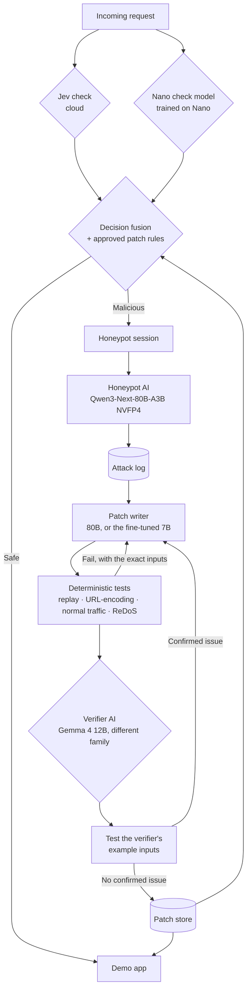

# Chameleon Edge

An AI security layer that reroutes malicious requests to a honeypot AI on the HP ZGX Nano, then turns each attack into a tested, independently verified security patch — instead of just blocking it and teaching the attacker nothing.

**30-second demo:** _TODO — record before submission (see NEXT STEPS in HANDOFF.md)._

## Results at a glance

All measured on one HP ZGX Nano (GB10) with public benchmark data; raw numbers in `results/`.

- **The system learns an attack it has never seen, in about 3 minutes.** Path traversal is deliberately held out of the check model's training. First wave: **0%** caught. The honeypot captures it, the Nano writes a patch, deterministic tests and a second model check it, and the approved rule then blocks **78% of 280 unseen path-traversal payloads with 0 false positives across 6,434 benign requests** (`results/redteam_scenario.json`; the whole live run took 191 s).
- **Normal users aren't touched:** 0 of 20 benign requests rerouted in the live run. SQL injection 10/10 and prompt injection 8/10 rerouted to the honeypot.
- **Two models trained on the Nano.** The check classifier gets 0.994 F1 on seen attack types (`results/check_metrics.json`). A **Qwen2.5-7B LoRA patch writer** was distilled on the Nano from the 80B model. On attack types it never trained on, it wrote **2.7× more fully-passing rules than its base model (10% vs 3.75%)**, raised recall from 35% to 46% (teacher: 50%), and cut false positives from 3.4% to 0.0%. [Published on Hugging Face](https://huggingface.co/Yukta3030/chameleon-edge-patchwriter), limitations included.
- **Everything fits on one box:** the 80B writer (54 GiB) and 12B verifier (34 GiB) serve side by side, using 101.5 of 121.6 GB. The writer does 36 tokens/s per stream and 169 tokens/s at 8 concurrent.
- **Models make claims; tests check them.** Live testing found an auto-generated rule that could freeze the app (ReDoS), a URL-encoding bypass, and a verifier rejecting a very good patch on claims that didn't hold up. Each became a deterministic check (see "Attacks and defenses").

## The problem, and who has it

**Target user:** a security engineer / SOC analyst protecting a company application from attacks, including insiders — "a cyber security professional" is one of HP's own example personas for this challenge.

- Blocking an attack teaches the defender nothing; the attacker just tries a variation.
- Studying attackers safely needs isolation, and a long attacker conversation through cloud AI costs real money per token.
- Writing and reviewing a fix for every new attack technique is slow, manual work.
- Attack data — payloads, techniques, logs — is sensitive and shouldn't leave the building to a third-party cloud.

**What it does:**
1. A fast check layer decides whether each incoming request is malicious.
2. Safe requests go straight to the protected application.
3. Malicious requests are quietly rerouted to a honeypot AI on the Nano, which keeps the attacker engaged and logs everything they try.
4. An AI on the Nano writes a security patch from the attack.
5. A second AI, from a **different model family**, plus deterministic tests, independently verifies the patch.
6. The approved patch feeds back into the check layer, so the same attack technique is caught immediately next time.

The demo covers both a regular web API (SQLi, XSS, command injection, path traversal) and an AI chatbot endpoint (prompt injection, jailbreaks). **The protected application is only a demo target — the product is the security layer in front of it.**

## Why edge, not cloud alone

- **Containment:** attacker traffic never reaches the real app; it stays trapped on one physical box.
- **Cost:** an attacker can chat with the honeypot for hours — zero marginal cost on the Nano, versus real per-token cost in the cloud.
- **Privacy / data residency:** attack logs, payloads, and patches never have to leave the Nano.
- **Works offline:** the Nano-side loop (honeypot, patching, verification) keeps running even if the cloud link drops; see "offline mode" below.

HP's own research shows attackers increasingly use AI to generate new attack variations faster than defenses can adapt (see References). Chameleon Edge answers with AI on the defense side: trap the attacker, learn from the attempt, ship a verified patch automatically. (We build on this research; HP hasn't published on this exact problem.)

## Architecture



**How the check layer / router works** (`chameleon/fusion.py`, `chameleon/router.py`): every request's untrusted fields go to (a) our own classifier trained and served on the Nano, (b) Jev — TypeSafe AI's cloud decision model, when available — and (c) every currently-approved patch rule. A request is malicious if *any* signal fires. If Jev is unreachable, the system falls back to the Nano model and rules alone — this is also how "offline mode" works: set `CLOUD_ENABLED=false` and nothing changes except Jev drops out of the vote. Both scores are logged for every request (`requests` table), because the disagreement cases are the interesting evidence.

**Orchestrator** (`chameleon/orchestrator/`): decides where each AI job (honeypot turn, write patch, verify patch) actually runs. Default is always the Nano; if a job's Nano model isn't routable (checked against the ZRT proxy's `/v1/models`, since `zrt services` was observed reporting "Ready" while the proxy still returned 404), it falls back to a configured cloud model (Anthropic, chosen specifically to avoid AWS — see "Attacks and defenses" below) and logs the placement, latency, tokens, and real cost. Policy lives in `config/routing.yaml`, not code.

## Attacks and defenses

| Layer | Defense |
| --- | --- |
| Isolation | Every model server is bound to `127.0.0.1`; only a keyed gateway is meant to be reachable beyond localhost (see Limitations — gateway not yet built) |
| Honeypot | Only fake data, fake credentials, fake files — never anything real |
| Canary tokens | Unique fake secrets planted in the honeypot and the demo app (`chameleon/demoapp/main.py`); if one shows up anywhere else, that's a detected leak. A canary tripping in the *real* demo app is also how an attack the check layer missed gets caught and routed into the patch loop |
| Prompt injection | Attacker text is always marked "untrusted data, not instructions" in every prompt sent to any model (honeypot, writer, verifier) |
| Patch safety | Nothing is ever auto-applied. A patch only reaches `approved` after four deterministic tests pass: **replay** (blocks every captured payload), **URL-encoding** (also blocks their encoded forms), **normal traffic** (blocks no real user input), and **ReDoS**. Then an independent verifier from a different model family reviews it. Every attempt is versioned and can be rolled back |
| ReDoS | Model-written regexes run on every live request, so a slow one would let the security layer itself be used for denial of service. Live testing caught the real writer producing patterns that took 3.3 s on an 8 KB input. Rules run on the `regex` engine with a **50 ms per-match cap that fails closed** (reroute, never wave through), and every candidate must finish 2 KB adversarial inputs inside that budget before approval |
| Encoding bypass | Found by the verifier on a live rule: a raw-regex patch let `%2e%2e%2f` walk past it. Now a deterministic test: every captured payload's URL-encoded form must also be blocked, which forces `normalize_then_deny` (decode repeatedly, then match) |
| Accountable verifier | The verifier must back every objection with **literal example inputs**, and the pipeline runs them against the rule. Claims that don't hold up are discarded. Measured live: before this change it rejected a rule with 85% recall on 280 unseen payloads and 0/6,434 false positives, citing 3 bypasses of which 2 were actually blocked |
| Verifier isolation | The verifier sees only the proposed rule, a sample of the attack (both marked untrusted), and our own test measurements — never the writer's reasoning or the raw attacker conversation, so an attacker can't hide an "approve this" instruction where the verifier would read it |
| Cloud minimization | Jev gets only what it needs to classify a request. Attack logs, patches, and analysis never leave the Nano |
| AWS sensitivity | The cloud fallback provider is Anthropic, not AWS Bedrock, since AWS people are judges for this event |

## Training pipeline on the Nano

The **check model** (`chameleon/check/`) is a TF-IDF + logistic-regression classifier trained from scratch on the Nano (`make train-check`, ~3 seconds, see `results/check_metrics.json`) — this satisfies the organizer requirement that a model we trained is hosted on the Nano, and doubles as the fallback/second-opinion check when Jev is down.

A held-out attack type (path traversal) is deliberately excluded from training (`chameleon/check/dataset.py`, `HELDOUT_ATTACK_TYPES`). Measured recall on it: **0%** — the classifier genuinely cannot catch an attack family it's never seen. That's not a bug we hid; it's the evidence for why the honeypot/patch loop exists at all. The red-team scenario (`python -m chameleon.redteam.scenario`) demonstrates the system closing that exact gap live: 0% on the first wave → patch written, tested, verified → 78% of 280 unseen payloads blocked, because the approved rule feeds back into the check layer.

### Fine-tuned patch writer (`training/`)

A **LoRA fine-tune of Qwen2.5-7B-Instruct**, distilled from the 80B writer entirely on the Nano:

1. **Verified data** (`generate_data.py`): the 80B teacher wrote 500 rules for SQLi, XSS, prompt injection, and jailbreak samples. A rule was kept only if it passed the same deterministic tests as production, plus ≤1% false positives on 300 benign requests it never saw: **230 kept**. The labels are verified by tests, not by a model's opinion.
2. **Training** (`train_lora.py`): r=16 on all attention and MLP projections, bf16, 2 epochs. **17.7 min on the GB10, 20.4 GiB peak.** Validation loss 0.678 → 0.642.
3. **Evaluation** (`eval_patchwriter.py`): on **command injection and path traversal, both excluded from training**. 80 tasks, the exact production prompt, greedy decoding. Every rule is scored by the deterministic tests:

| | Base Qwen2.5-7B | **Fine-tuned 7B** | 80B teacher |
|---|---|---|---|
| Rule fully passes | 3.75% | **10.0%** | 13.75% |
| Recall on unseen payloads | 35% | **46%** | 50% |
| False-positive rate | 3.4% | **0.0%** | 0.01% |
| Valid output | 90% | **65%** | 85% |

The fine-tune closes most of the gap to a model ~10× its size, and it beats the teacher on command injection (12.5% vs 7.5% full pass). Its real weakness is that it falls into repetition loops on about a third of outputs. In production the pipeline retries on invalid output, so that costs attempts, not safety. [Adapter + model card on Hugging Face.](https://huggingface.co/Yukta3030/chameleon-edge-patchwriter)

## Benchmarks

See `docs/benchmark-methodology.md` for why each metric was chosen. Everything below was measured on the Nano with both LLMs and the check model serving.

| Model | 1 stream | 4 concurrent | 8 concurrent | Memory |
|---|---|---|---|---|
| Writer: Qwen3-Next-80B-A3B, NVFP4 | 36 tok/s, p95 0.71 s | 109 tok/s | 169 tok/s, p95 1.33 s | 54.3 GiB |
| Verifier: Gemma 4 12B, bf16 | 7.5 tok/s, p95 3.96 s | 34 tok/s | 62 tok/s, p95 3.45 s | 34.3 GiB |
| Check model (TF-IDF + LogReg) | 0.36 ms median / 0.56 ms p95 per request | | | CPU, tiny |

**The 80B model is ~5× faster per stream than the 12B one.** Decoding on the GB10 is memory-bandwidth bound. The MoE reads only ~3B active parameters at 4 bits per token, while the dense 12B reads all ~24 GB of its bf16 weights per token, which caps it near 10 tok/s. The obvious next speedup is quantizing the verifier. Whole box: 101.5 / 121.6 GB used with everything running.

Raw files: `results/check_metrics.json`, `llm_baseline.csv`, `system_memory.json`, `redteam_scenario.json`, `finetune_*.json`.

## Quick start

```bash
python3 -m venv .venv && source .venv/bin/activate
cp .env.example .env          # fill in HF_TOKEN, JEV_API_KEY, ANTHROPIC_API_KEY as needed
make setup                    # install Python packages
make data                     # download the check-model datasets
make train-check              # train + serve-ready the Nano check model
make test                     # unit tests

make serve-check              # check model API on :8010
make serve-demo               # demo target app on :8200
make serve-dashboard          # backend API + live dashboard on :8100
```

## ZGX Nano setup (zrt / model serving)

```bash
uname -m; nvidia-smi; zrt status; zrt models     # sanity check
zrt pull hf:nvidia/Qwen3-Next-80B-A3B-Instruct-NVFP4   # honeypot + patch writer, ~51 GB
zrt pull hf:google/gemma-4-12B-it                       # patch verifier, ~24 GB

# Serves both behind ONE shared proxy on :8080, routed by model name (not one
# port per model -- see HANDOFF.md 5.4), writer first, then verifier.
scripts/serve_models.sh
```

Every flag in `scripts/serve_models.sh` fixed a real failure we hit on the Nano (full detail in `HANDOFF.md` sections 5.4 and 6.4):
- **Context length:** `zrt serve` doesn't bound it by default. The 80B model defaulted to `max_model_len=262144` and silently OOM'd mid-startup, so we pass `--extra '--max-model-len=8192'`.
- **Kernel compilation:** on first run FlashInfer JIT-compiles CUDA kernels with ~20 parallel `nvcc` jobs, and one got OOM-killed next to the loaded model. `MAX_JOBS=4` fixes it. The first writer start takes ~15–20 min; the kernels are cached after that.
- **Memory split:** auto-sizing gave the writer 79 GB, leaving the verifier too little host RAM (CPU and GPU share the same 121 GB). We now set writer 0.45 and verifier 0.25 explicitly.
- **Proxy race:** right after a `zrt stop`, a fresh `zrt serve` can be deregistered by the proxy 2–3 seconds later even though the backend underneath is fine. The script refuses to start unless `zrt services` is empty.

To view the dashboard from a laptop: `ssh -L 8100:127.0.0.1:8100 hpX@<tailscale-ip>`, then open `http://127.0.0.1:8100`.

## API

- **Check model** (`:8010`) — `GET /health`, `POST /check {"inputs": [str, ...]}` → `{"malicious": bool, "score": float, "worst_input_index": int, "latency_ms": float}`.
- **Demo app** (`:8200`) — `GET /search?q=`, `POST /login`, `GET /files?name=`, `POST /chat`. Every endpoint enforces currently-approved patch rules before responding.
- **Dashboard/backend** (`:8100`) — `GET /` (the dashboard), `GET /api/summary|requests|sessions|patches|llm_calls`, `POST /api/scenario/run`, `POST /api/demo/reset`, `WS /ws` (live summary, once a second).

## Safety boundaries

- No real user data anywhere in the demo — products, accounts, and files are all fabricated, and canary tokens make a leak detectable immediately.
- The "attacker" in every demo/benchmark run is our own red-team script (`chameleon/redteam/scenario.py`), never a real attack against anything outside this project.
- The Nano is never exposed to the public internet; model servers are localhost-only.
- We never claim the Nano can only run one model at a time — false, and something HP judges would catch; the honest reason Jev's check runs in the cloud is that Jev is offered only as a hosted API.

## Limitations (current status)

- [x] Check model trained + served on the Nano
- [x] Honeypot, patch writer, verifier, and patch pipeline (4 deterministic tests + accountable verifier), all live on real models
- [x] Front door (fusion of Nano check + Jev + approved rules), orchestrator, backend API, live dashboard
- [x] Red-team scenario closing the loop live: 0% → 78% on a never-seen attack type
- [x] LoRA fine-tune on the Nano, evaluated on held-out attack types, published to Hugging Face
- [x] Benchmarks with both LLMs serving side by side
- [ ] Nano gateway (keyed reverse proxy in front of the honeypot) — not built; today the honeypot is called in-process, not over a network boundary
- [ ] Jev integration — client is a stub; TypeSafe AI access is still on the waitlist, so the system runs on the Nano check model alone
- [ ] The fine-tuned 7B isn't yet the default writer in production. It's evaluated and published, but serving it needs the backend-socket route (`llm.timed_call(uds=...)`), because ZRT's proxy doesn't route LoRA adapters

**Known weaknesses, measured:**
- Regex rules generalize well to structured attacks and poorly to natural-language ones. In the fine-tune data, teacher rules reached a median 80% recall on unseen SQLi but only 6% on unseen prompt injection. That's why prompt injection relies on the trained classifier and the honeypot, not on patches.
- The approved path-traversal rule has one recorded known bypass: Windows-style backslash paths (`..\..\`). The pipeline logged it as a known gap rather than hiding it.
- The fine-tuned 7B gets stuck in repetition loops on about a third of outputs.
- Prompt injection: 8 of 10 caught in the live run, not 10.
- Everything here comes from one day, one Nano, and public/synthetic data. None of it describes enterprise-scale performance.

## References

- HP research this project builds on (not "HP published this exact idea"):
  - [Low-effort AI-built attacks beating defenses](https://www.hp.com/us-en/newsroom/press-releases/2026/hp-research-low-effort-ai-attacks-beating-defenses.html)
  - [Cybercriminals leaning into agentic AI](https://www.hp.com/us-en/newsroom/press-releases/2026/hp-research-cybercriminals-leaning-into-agentic-ai-momentum-to-steal-crypto-wallets.html)
  - [HP Wolf Security Threat Insights Report, September 2026](https://threatresearch.ext.hp.com/hp-wolf-security-threat-insights-report-september-2026/)
- [Unit 42: indirect prompt injection in the wild](https://unit42.paloaltonetworks.com/ai-agent-prompt-injection/)
- Datasets: [HttpParamsDataset](https://github.com/Morzeux/HttpParamsDataset) (MIT), [deepset/prompt-injections](https://huggingface.co/datasets/deepset/prompt-injections), [jackhhao/jailbreak-classification](https://huggingface.co/datasets/jackhhao/jailbreak-classification)

## Team

HP Edge AI SJSUHack, Secure AI track. Full design history and every decision's rationale: `HANDOFF.md`.
